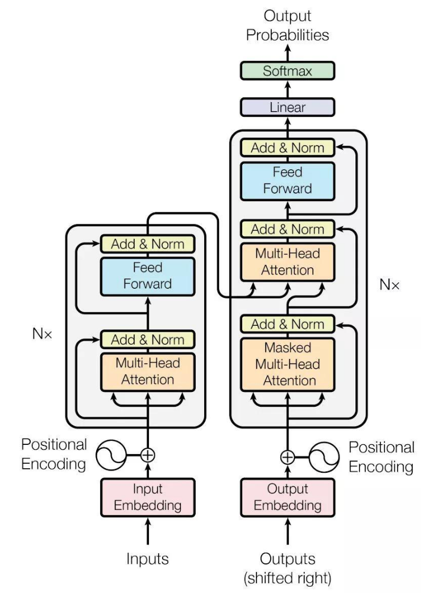
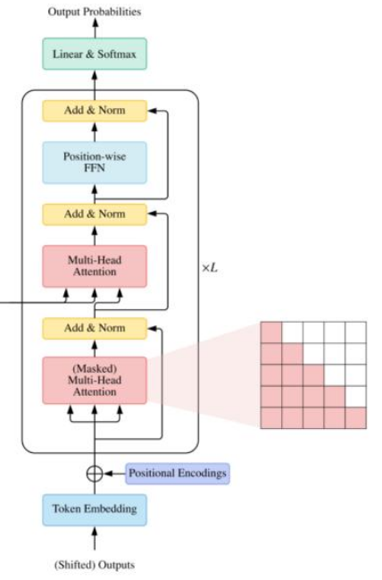
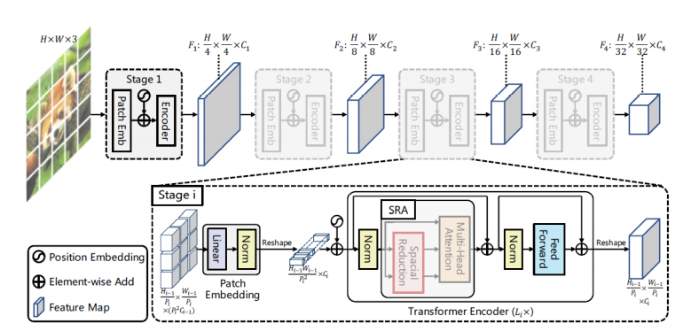

## Transformer

**1. NLP Transformer**

-  Transformer全局概述

	- Transformer主要由多个Encoder和Decoder组成
	- 将Encoder和Decoder展开后，加上前后处理的PE模块（Positional Encoding和Embedding）

- 单一模块概述

	- 前后处理PE模块 
	  
      
		- Embedding
 		    
            对输入输出进行向量编码
			- word2vec等方法
			- pytorch中使用nn.Embedding来实现
			- 给定编码输出维度512，对于长度为N的输入字符有$N\times512$

		- Postition Encoding

		  因为 RNN 是按顺序对句子进行处理的，一次一个 word。但是在 Transformer 中，输入句子的所有 word 是同时处理的，没有考虑词的排序和位置信息。所以要加入Positional Encoding。公式如下：
          
          $$PE(pos, 2i) = sin(\frac {pos}{10000^{2i/d_{model}}})$$
          $$PE(pos, 2i+1) = cos(\frac {pos}{10000^{2i/d_{model}}})$$
          
          - pos指的是当前词在句子中的位置即N的位置，i表示embedding后的向量维度对应512
          
          	
            
       - Embedding 与 Postition Encoding的信息融合
			
            
			
  - Encoder模块       
          
	
    
    - 多头注意力机制

		- 公式：
        
        $$Attention(Q,K,V) = softmax(\frac {Q\cdot K^T}{\sqrt{d_k}})  V$$
        	- $Q、K$为矩阵，$V$为向量，$\cdot$表示矩阵乘法，省略表示元素成

			- 计算图示
		
        	
            
     - 输入单词embedding向量下$Q、K、V$的获取
     	- 多头注意力机制的学习参数矩阵为查询向量$W^Q$、键向量$W^K$、值向量$W^V$
     	- 通过embedding向量与矩阵相乘获取到对应的$Q、K、V$
        
    	
        
      - 依据公式计算Attention相似度

		
        
     - 在多套学习参数矩阵$W_i^Q$、$W_i^K$、$W_i^V$，得到$z_i$

		
        
     - 向量矩阵$z_i$ concat以及线性变换

		
        
     - 流程总结

		
        
   - 残差模块与LayerNorm

		
        
        - 经过位置编码后的输入向量与经过注意力机制后的attention值进行相加
        - LayerNorm
        
        	- BatchNorm针对通道维度，对特征进行归一化，对batch较小时效果不明显
        	- 不适用于sequence长度不同的时候
        	- 单独对一个sequence中进行Normalize

	- 前馈神经网络

		Feed Forward层是一个两层的fully-connection层
        
  - Decoder模块   

	
    
    - 输入

		每一时刻Decoder的输出都会作为下一时刻的输入
  
    - 多头注意力机制（masked）
      
      masked 表示掩码，它对某些值进行掩盖，使其在参数更新时不产生效果。Transformer 模型里面涉及两种 mask，分别是 padding mask 和 sequence mask。
     
     
     
    - 多头注意力机制的交互

		由Encoder提供$Q、K$,Decoder提供$V$矩阵

		
        
**1. CV Transformer**

- ViT
	
    - ViT整体结构
		
    
    	- 实际上只使用了Transformer的Encoder

	- ViT结构的数据流

		
        
        - 输入端预处理
        
            - 图像数据切分

                通过slice、reshape以及transpose的操作实现对原始数据的切分重排，然后

                $$[b,c,h,w] -> [b,N,P^2c]$$

                - $P$ 当个patch的图片大小，例如32，32
                - $N$ 表示使用$P$进行pack后产生的patch块数量
                - 作为将图像分割成 patch 的一种替代方案，输出序列可以通过 ResNet 的中间特征图来形成。

            - Patch Embedding

				对每个向量都做一个线性变换（即全连接层），压缩维度为dim
            
            - class_token（Patch0）

                设置可学习参数作为整合信息的向量，用于最后的分类输出，如果只有原始输出的9个向量用哪个向量来分类都不好，全用计算量又很大
                
                这个patch0与其他的patch块数量进行concat
                
            - Positional Encoding
				
                图像切分重排后失去了位置信息；并且Transformer的内部运算是空间信息无关的；所以需要把位置信息编码重新传进网络			
    
				引用一个$[1, num_patches + 1, dim]$的可学习参数,，作为位置嵌入向量
                直接与对应的patch进行相加计算
            
      - Transformer Encoder    

		
		- Norm —— LayerNorm    

			在每一个样本上计算均值和方差；同层神经元输入拥有相同的均值和方差，不同的输入样本有不同的均值和方差
            
       - Multi-Head attention
          
          - 对每个输入的Q查询向量、K键值向量，V价值向量构建，通过学习权重的矩阵乘法实现并行化计算

			
          
          - 依据attetion公式计算

			
            
         - 将每个attention的输出向量进行concat，通过一个线性层，融合各个通道的信息
         
         
     	 - MLP

	 - MLP head

		主要针对输出的维度需要进行线性变换
        
- PVT

	
	- 背景

		- ViT很强，但是在下游任务难以使用（检测+分割）

			- 显存占用

				- 主要存在大量的FC（MatMul）的训练参数

			- 表示方法 

				- Encoder输入输出大小一致，没有类似图像金字塔的表示
				
                
            - 训练所需数据量大

		- ViT无法直接套用FPN（已有论文做过实验）

			- 图像金字塔的传统使用

				- Sift特征点检测中的使用
					
                    图像模糊的差值强化边缘信息；不同尺度获得不同尺度下的边缘信息
					
                    
                - Spatial Pyramid Matching（分块提取特征）
					
                    对图像进行分块，统计特征出现的次数，往往使用直方图
					
                
                - Spatial Pyramid Pooling
					将特征图分块pooling再拼接
                    
               	- FPN

					
	- 贡献

		- 使用了图像金字塔 progressive shrinking pyramid,输出多分辨率的Feature Map
		- 结合CNN和ViT的优势，实现了一个运用在多任务上的backbone

	- Patch Embedding

		- 通过使用卷积操作实现对将原图切成总数为$p_i \times p_i$的patches
        	
            $$kernal\_size = stride = \frac{H}{p_i}$$
            
        - 将每个patch内的数据拉平，然后进行LayerNorm,数据大小为

			$$\frac{H_0 \cdot W_0}{p_i^2} \times C_i$$
        
	- Spatial Reduction Attention设计

		

		- 直筒型结构的缺点分析

			- ViT中Feature Map的分辨率依赖于PatchSize，但是PatchSize依赖于输入图像数据的尺寸
			- 导致使用分辨率受限

		- 图像金字塔无法嵌入的原因

			- q,k的数量和切分patch的大小相关
				- PatchSize越小，q，k越多，MHA计算越慢，显存占用越高
				- PatchSize越大，feature map分辨率越低，会影响下游任务表现
		- 解决方案（设计思路）
		
       	
        
        	在encoder输出的Feature Map上继续切分patch，然后使用线性层实现特征通道切换
       
       - 计算原理
       
       		
            
            - $Reshape(x,R_i)$ 

				设输入$x$的大小为$HW \times C$, $Reshape$成$\frac{H \cdot W}{R_i^2} \times C'$，最后经过与$W^S$矩阵乘得到$\frac{H \cdot W}{R_i^2} \times C_i$
                
- Swin-Transformer

	- 研究背景

		- ViT 的缺点

			CV中的 Token （网络处理的最小输入单元） 应该多大？
            
    - 研究意义

		- 被广泛接收的在下游任务的使用纯 Trnasformer 结构的方式

	- 网络整体结构

	